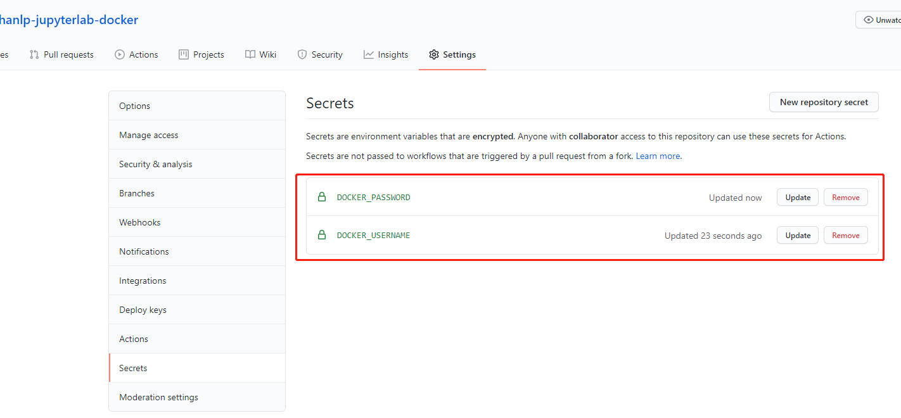
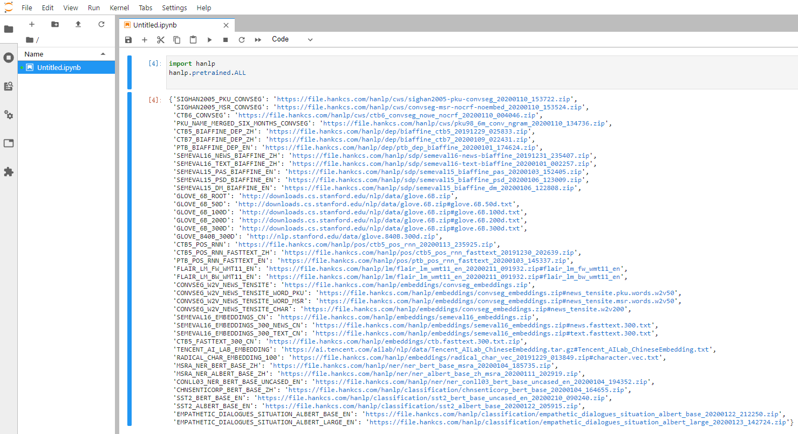

# hanlp-jupyterlab-docker
一个集成jupyterlab编辑器的hanlp docker 镜像，并且使用github actions将镜像推送到自己的镜像仓库，便于快速体验hanlp
# 使用github actions实现自动将镜像推送到自己的镜像仓库

在`.github/workflow`目录下面创建`docker-image.yml`文件，文件内容如下：
```
  
name: Docker Image CI

on:
  push:
    branches: [ main ]
  pull_request:
    branches: [ main ]

jobs:

  build:
    runs-on: ubuntu-latest
    steps:
    - uses: actions/checkout@v2
    - name: Build the Docker image
      run: | 
        docker version
        # 登录阿里云镜像仓库
        docker login --username=${{ secrets.DOCKER_USERNAME }} --password=${{ secrets.DOCKER_PASSWORD }} registry.cn-shenzhen.aliyuncs.com
        # 使用Dockerfile构建镜像
        docker build . --file Dockerfile --tag registry.cn-shenzhen.aliyuncs.com/devan/hanlp-jupyterlab
        # 推送镜像到镜像仓库
        docker push registry.cn-shenzhen.aliyuncs.com/devan/hanlp-jupyterlab
```
> github actions的workflow语法可以查看[官方文档](https://docs.github.com/cn/free-pro-team@latest/actions/reference/workflow-syntax-for-github-actions)


其中登录docker的用户名密码配置在secrets中，如下图所示：



在secrets中设置好登录docker的用户名和密码后，还需要将上面的仓库地址和镜像名称`registry.cn-shenzhen.aliyuncs.com/devan/hanlp-jupyterlab`修改为自己的仓库地址和镜像名称

点击`Actions`即可查看运行状态

# 使用方法
使用如下命令启动容器：
```
 docker run --name hanlp -d  -p 8888:8888 registry.cn-shenzhen.aliyuncs.com/devan/hanlp-jupyterlab
```
使用如下命令查看容器启动日志：
```
docker logs -f hanlp
```
输出日志内容如下：
```
[I 08:32:53.729 LabApp] Writing notebook server cookie secret to /root/.local/share/jupyter/runtime/notebook_cookie_secret
[I 08:32:54.086 LabApp] JupyterLab extension loaded from /usr/local/lib/python3.8/site-packages/jupyterlab
[I 08:32:54.086 LabApp] JupyterLab application directory is /usr/local/share/jupyter/lab
[I 08:32:54.089 LabApp] Serving notebooks from local directory: /jupyter
[I 08:32:54.089 LabApp] Jupyter Notebook 6.1.5 is running at:
[I 08:32:54.089 LabApp] http://e2a864c5022b:8888/?token=05585b841aafc641b9e81a10b668b599a151156b2d8070b8
[I 08:32:54.089 LabApp]  or http://127.0.0.1:8888/?token=05585b841aafc641b9e81a10b668b599a151156b2d8070b8
[I 08:32:54.089 LabApp] Use Control-C to stop this server and shut down all kernels (twice to skip confirmation).
[C 08:32:54.093 LabApp] 
    
    To access the notebook, open this file in a browser:
        file:///root/.local/share/jupyter/runtime/nbserver-1-open.html
    Or copy and paste one of these URLs:
        http://e2a864c5022b:8888/?token=05585b841aafc641b9e81a10b668b599a151156b2d8070b8
     or http://127.0.0.1:8888/?token=05585b841aafc641b9e81a10b668b599a151156b2d8070b8

```
在浏览器中可以测试hanlp，如下图所示：




